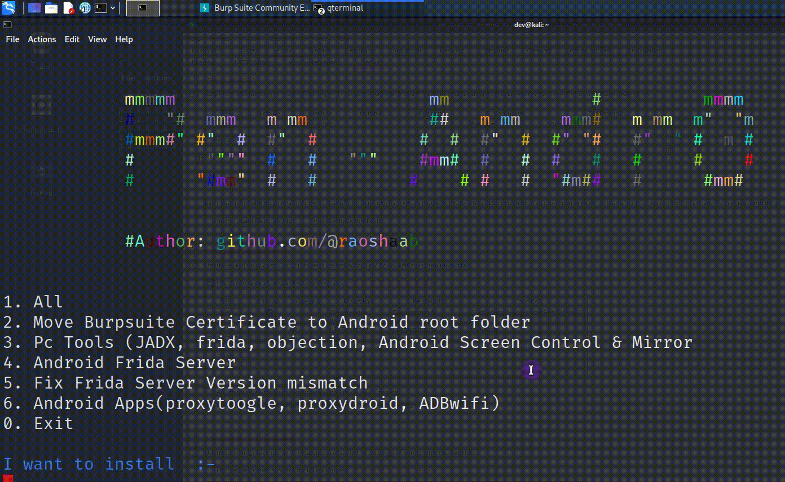
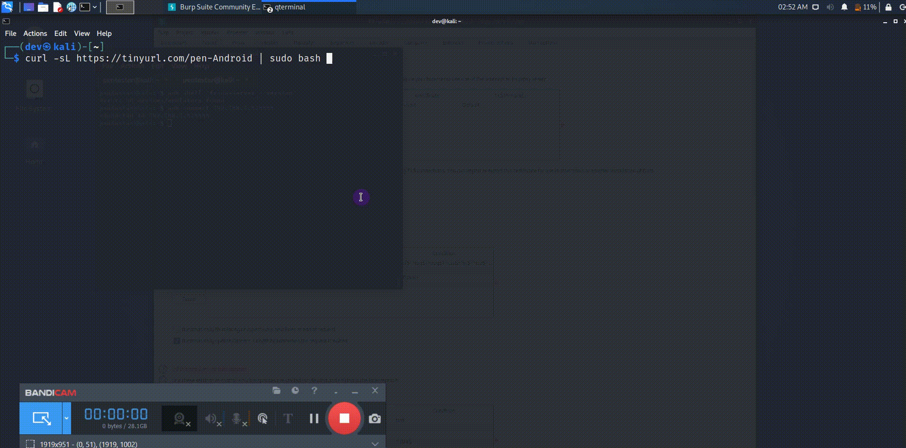

# Pen-Andro


 



## 💥 Introduction 
This Script will automate the process of installing all necessary tools & tasks for Android Pentesting i.e Moving Burpsuite Certificate ,Installing Adb frida server, APKs like proxy toggle, proxydroid, adbwifi.  


## 🛠️ Usage

1. Open Terminal  
2. Run below command

```
curl -sL https://tinyurl.com/pen-Android | sudo bash 
```
Tool installed , access with command 
```
pen-andro
```
## Preconditions
 
* Kali-Linux or wsl in Windows(Version 1 recommended)  [Installation Method ](https://learn.microsoft.com/en-us/windows/wsl/install) 
* Burpsuite proxy Running at 127.0.0.1:8080 or you can specify the ip:port 
* Rooted Android device connected via adb (Only one device should be connected)

* Magisk App  (It will make installation easy ) 
1. For Android Virtual device (https://github.com/newbit1/rootAVD)
2. For Genymotion emulator [Blog Link here](https://support.genymotion.com/hc/en-us/articles/360011385178-How-to-install-Xposed-or-Magisk-Edxposed-with-Genymotion-Device-image-PaaS-)
3. For Physical device search <Device_name> magisk xda 


### I want to Install  :- 

```console

curl -sL https://tinyurl.com/pen-Android | sudo bash


            mmmmm                         mm              #          mmmm
            #   "#  mmm   m mm            ##   m mm    mmm#   m mm  m"  "m
            #mmm#" #"  #  #"  #          #  #  #"  #  #" "#   #"  " #  m #
            #      #""""  #   #   """    #mm#  #   #  #   #   #     #    #
            #      "#mm"  #   #         #    # #   #  "#m##   #      #mm#


            #Author: github.com/@raoshaab


1. All
2. Move Burpsuite Certificate to Android root folder
3. Pc Tools (JADX, frida, objection, scrcpy)
4. Android Frida Server
5. Fix Frida Server Version mismatch
6. Android Apps(ProxyToogle, Proxydroid, ADBwifi)
7. Pull Apk from device 
0. Exit

I want to install  :-
```

## Screenshots 


## 🛠️ Features

### Android Apps 
* Proxy droid

 

* ADB wifi


* Proxy Toggle


### Pc Tools 
* Frida, objection & Frida-Server for Android


* jDax-gui 


* scrcpy 


* Burpsuite Certificate install


## FAQs :
* Burpsuite Error :-  Check Proxy tab of Burpsuite at set the proxy as 127.0.0.1 with port 8080
* Root access Error :-  Check If your device is Rooted or not (If not confirmed check 
* Traffic not intercepting :- Reboot the device after Certificate installtion 
* One or more devices conncted :- check with ```adb devices``` or try ```adb kill-server```(to remove offline devices)


## Credits :

1. skylot  https://github.com/skylot/jadx
2. frida https://github.com/frida/frida
3. Madeye https://github.com/madeye/proxydroid
4. Sujan Poudel https://github.com/psuzn/ADB-WiFi
5. Voicu Klein,Fidel Montesino https://github.com/theappbusiness/android-proxy-toggle]
6. Genymobile https://github.com/Genymobile/scrcpy

